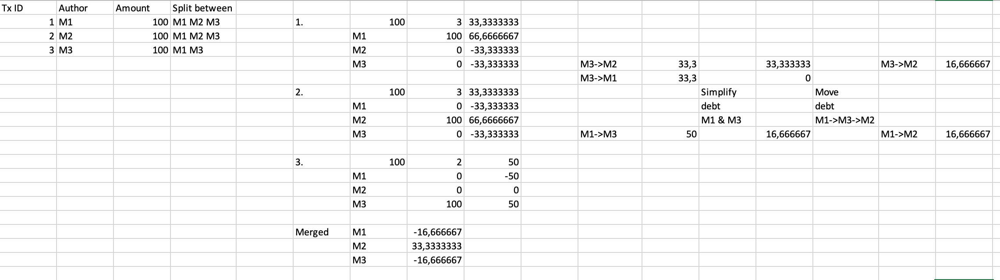

# Unit tests tasks

## Task 1
This task was initially solved in the MS Excel and used for assertion of algorithm implementation.
See `TxProcessingLogicTests.Should compute debts resolving transaction for five users` test for more info.

## Task 2
This task was initially solved in the MS Excel and used for assertion of algorithm implementation.
See `TxProcessingLogicTests.Should compute debts resolving transaction for tree users with different splitting rules` and `Should calculate debts matrix for three users with different splitting rules` tests for more info.

